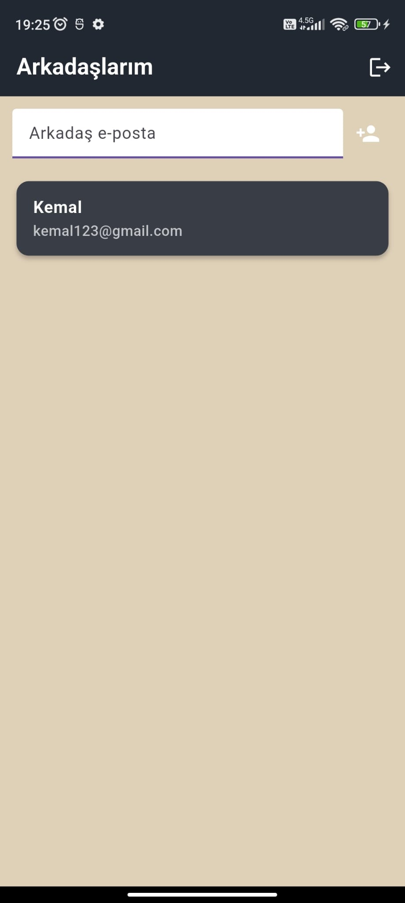

# Message App
Message App is a simple and user-friendly chat application built with Flutter and powered by Firebase. Users can register with their email, name, and password, then add friends via their email addresses and start one-on-one conversations.
## Features
* User registration and login with Firebase Authentication

* Real-time messaging via Cloud Firestore

* Add friends using email address

* One-on-one chat interface

* Clean and user-friendly UI

Cross-platform compatibility with Flutter
## Appliacitons Image
<table align="center">
  <tr>
    <td align="center">
       
      <b>Login Page</b>
    </td>
        <td align="center">
       
      <b>Register Page</b>
    </td>
    <tr>
             <td align="center">
       
      <b>Main Page</b>
    </td>
    <td align="center">
       
      <b>Chat Page</b>
    </td>
    </tr>
  </tr>

</table>

## Setup
1- Install the required packages:
  
  flutter pub get  

2- Run the application:

  flutter run  
